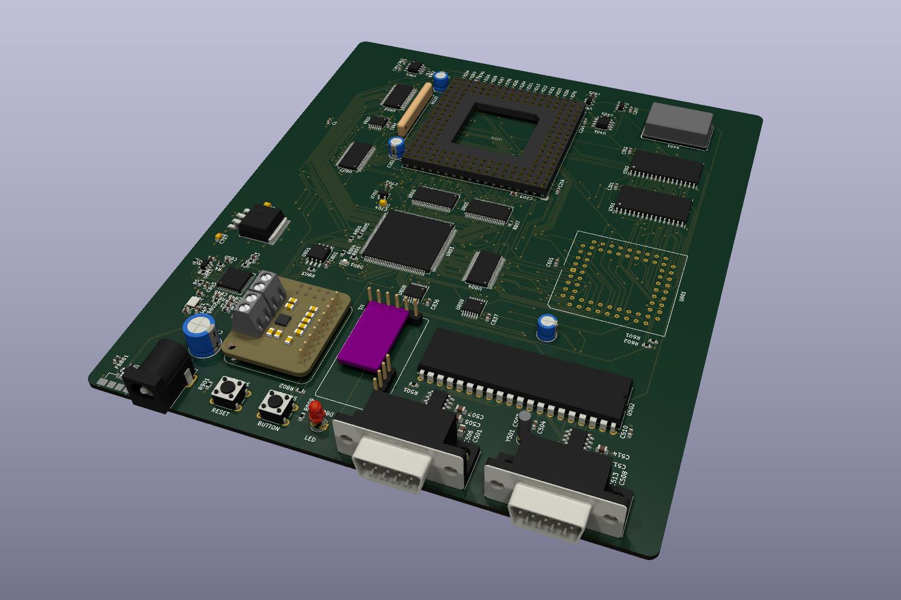

# 68040pc

Welcome to the `68040pc` (working name) project, an ambitious endeavor to build
a general-purpose computer platform powered by the Motorola 68040 (or, in this
case, the 68LC040) CPU. Inspired by creations like Ben Eater's breadboard 6502
computer and me finding a 68LC040 in a bin, this project seeks to bring the
charm of vintage computing into the modern era with a twist of power and
utility. Call me crazy, but I expect to be able to use this machine when it's
done.

## Status

The `testboard` design is almost complete. I'm going to sleep on the design
before ordering boards. The FPGA does address decoding and interrupt
management and will contain a sound core to output some cool beeps through
the I2S DAC module. I'm pleased with how the project is going so far!

## Objectives

The `68040pc` aims to be versatile and user-friendly, with the following
capabilities:
- **Input/Output**: Support for keyboard (text input) and mouse for GUI
  interactions.
- **Display**: Text display for command-line operations and a graphics display
  ready for GUI applications.
- **Storage**: Compatibility with standard bulk storage devices, including
  floppies and hard drives.
- **OS**: Capability to run a preemptive multitasking operating system.
- **Expansion**: A robust expansion system, ensuring the platform remains
  relevant and adaptable after its initial production.

## Performance Expectations

With the integration of the 68040 CPU and the potential to accommodate up to
512MB of RAM, I anticipate the `68040pc` will rival the performance metrics of
systems like the Amiga, especially in terms of computational power. Although the
base system might not match the Amiga's graphical prowess, there's potential for
future enhancements via expansion cards to bring it to that level.

## Learning and Documentation

This journey isn't just about creating a new machine—it's a significant learning
curve for me, and I want it to serve as an educational resource for others.
Every step of the way, the system will be meticulously documented. From design
decisions to implementation nuances, the goal is to demystify the process and
make the knowledge accessible to all.
